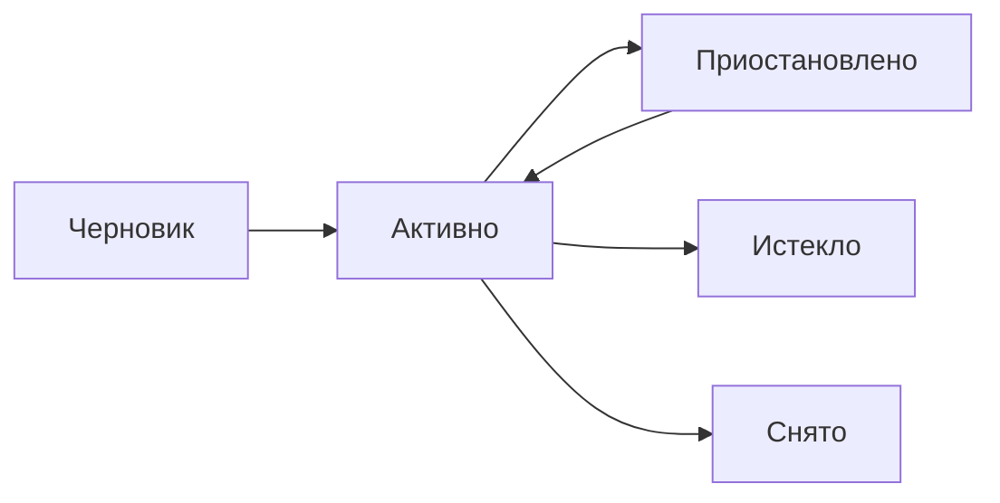

# Размещения

Размещение — факт публикации объекта на рекламном канале. Один объект может быть размещён на нескольких каналах одновременно.

Публикация производится **вручную** менеджером. Система отслеживает состояние и уведомляет о необходимых действиях.

## Каналы

| Канал | Срок жизни | Стоимость | Особенности |
|-------|-----------|-----------|-------------|
| Крыша.kz | 30 дней (пакет) | Платно | Истекает, нужно продлять |
| Instagram (пост) | Бессрочно | Бесплатно | Органический охват |
| Instagram (реклама) | По бюджету | Платно | Детальные метрики |
| Telegram (канал) | Бессрочно | Бесплатно | Органический охват |
| Email рассылка | Одноразово | Бесплатно | Отправлено — готово |
| WhatsApp | Одноразово | Бесплатно | Ручная рассылка |

## Статусы размещения

- **Черновик (draft)** — запланировано, но ещё не опубликовано
- **Активно (active)** — объявление опубликовано на канале
- **Приостановлено (paused)** — временно приостановлено
- **Истекло (expired)** — срок размещения истёк (автоматически для каналов с ограниченным сроком)
- **Снято (removed)** — снято вручную или автоматически при выводе из пула

## Как создать размещение

1. Откройте карточку объекта
2. Перейдите на вкладку **Маркетинг**
3. В таблице размещений нажмите **Добавить строку**
4. Выберите канал, заполните даты и ссылку
5. Установите статус **Активно** после публикации

## Метрики

На каждом размещении можно отслеживать:

- **Просмотры** — сколько раз просмотрено объявление
- **Клики** — переходы по ссылке
- **Лиды** — количество обращений

Метрики обновляются вручную менеджером.

## Уведомления

Система автоматически уведомляет через Odoo Bot (Telegram):

- Объект в пуле, но **не размещён ни на одном канале** — напоминание о публикации
- Размещение **истекает через 3 дня** — напоминание о продлении
- Объект **снят с пула**, но размещения ещё активны — напоминание снять объявления
